# NASA SPOKE-GeneLab Knowledge Graph

This repository contains the code and metadata needed to build a **Knowledge Graph (KG)** for [NASA GeneLab](https://www.nasa.gov/osdr-genelab-about/) omics datasets hosted on the [Open Science Data Repository (OSDR)](https://osdr.nasa.gov/bio/repo/search?q=&data_source=cgene,alsda&data_type=study).

---


## Objective 2: Neo4j Setup(May 3, 2025 - KnowHax)

In this objective, Neo4j was successfully installed and integrated into the project to provide graph-based data storage and querying capabilities. The Neo4j database is now running locally and can be accessed via `bolt://localhost:7687`. 

The repository was updated to include the Neo4j setup in a dedicated branch (`objective-2-neo4j-setup-GasMan`), which was created to ensure that changes related to this objective are isolated and easy to track. The necessary configuration files were added, and a `.gitignore` update was made to prevent unnecessary files (such as API responses and large data outputs) from being committed.

With this setup, the project is now prepared for the next steps in utilizing Neo4j to store and query graph data, which will be essential for the objectives ahead.


## 🚀 Features

- **Automated graph construction** from datasets in the OSDR
- **Incremental update** for new datasets
- **Statistical filtering** of results for significance
- **Species selection** via a configurable whitelist
- **Versioned metadata** for reproducibility (v0.0.3)
- **Federated query** using Neo4j Fabric with the [Scalable Precision Medicine Open Knowledge Engine (SPOKE) KG](https://spoke.ucsf.edu/)

---

## 🧪 Supported Data Types

| Measurement                  | Technology                                              | Property         | Selection Criteria |
| ---------------------------- | ------------------------------------------------------- | -----------------|-----------------|
| Transcription profiling      | RNA Sequencing (RNA‑Seq)                                | Log2 fold change | Adjusted p-value <= 0.05 |
| Transcription profiling      | DNA microarray                                          | Log2 fold change | Adjusted p-value <= 0.05 |
| DNA methylation profiling    | Whole Genome Bisulfite Sequencing                       | Methylation difference % | q-value <= 0.05 |
| DNA methylation profiling    | Reduced‑Representation Bisulfite Sequencing (RRBS)      | Methylation difference % | q-value <= 0.05 |

---

## ⚙️ How It Works

1. **Fetch** omics study records using the OSDR API  
2. **Filter** datasets by statistical thresholds and target species  
3. **Map** model organism genes to human genes
4. **Map** cell and tissue types to the [Cell (CL)](https://bioportal.bioontology.org/ontologies/CL) and [Uber Anatomy Ontology (UBERON)](https://bioportal.bioontology.org/ontologies/UBERON) ontology, respectively 
5. **Export** CSV files for graph database upload
6. **Import** CSV files into a Neo4j Graph database

---

## 🕸️ Graph Schema

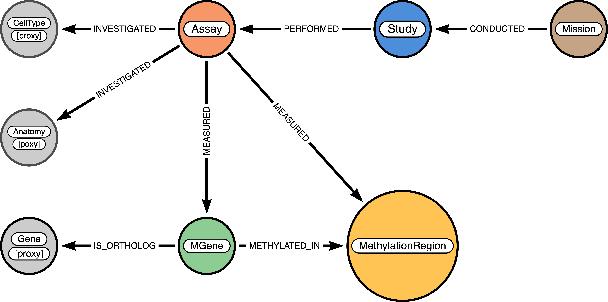

**Figure**: Schematic overview of the GeneLab knowledge graph structure, highlighting key node types (circles) and relationships (arrows).

The `Assay–MEASURED–MGene` relationship encodes Log₂ fold changes derived from transcription profiling assays, while the `Assay–MEASURED–MethylationRegion` relationship captures methylation differences identified through DNA methylation assays. The `MGene–METHYLATED_IN–MethylationRegion` relationship links model organism genes (`MGene`) to 1,000 base pair genomic regions (`MethylationRegion`) exhibiting differential methylation.

Proxy nodes (shown in gray) represent standardized identifiers for human genes (ENTREZ ID), anatomical structures (UBERON ID), and cell types (CL ID), enabling integration with external Neo4j databases and supporting composite graph database construction.

Diagram generated using [arrows.app](https://arrows.app).

---

## 📁 Metadata Directory Structure

The following node and relationship metadata files define the graph schema.

- **Nodes**  
  [kg/v0.0.3/metadata/nodes/](kg/v0.0.3/metadata/nodes/)

- **Relationships**   
  [kg/v0.0.3/metadata/relationships/](kg/v0.0.3/metadata/relationships/)

The organization and conventions for defining the metadata and data are described in the [kg-import](https://github.com/sbl-sdsc/kg-import) Git repository.

---

## 🔗 SPOKE - GeneLab Composite Database

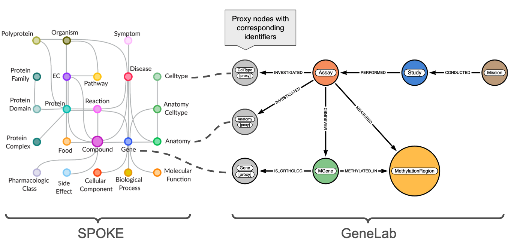

**Figure**: Integration of the SPOKE and GeneLab knowledge graphs using proxy nodes.  
The **GeneLab** graph (right), a knowledge graph representing spaceflight omics datasets, depicts key experimental entities: `Assay`, `Study`, `Mission`, `MGene`, and `MethylationRegion`, along with their relationships. 
**Proxy nodes** (gray) represent external identifiers (ENTREZ, UBERON, CL) and enable linkage to the **[SPOKE](https://spoke.ucsf.edu/)** graph (left), a rich biomedical knowledge graph comprising biological processes, molecular functions, diseases, compounds, and more. The dashed lines indicate mappings to enable the construction of a [composite Neo4j graph database](https://neo4j.com/docs/operations-manual/current/tutorial/tutorial-composite-database/). The composite graph enables federated queries across multiple KGs.

---

## ⚙️ Data Import Into Neo4j Knowledge Graph

### Setup Neo4j Desktop

1. Download the Neo4j Desktop application from the [Neo4j Download Center](https://neo4j.com/download-center/#desktop) and follow the installation instructions.

2. When the installation is complete, Neo4j Desktop will launch. Click the `New` button to create a new project.

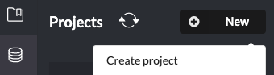

3. Hover the cursor over the created project, click the edit button, and change the project name from `Project` to `spoke-genelab`.


4. Click the `ADD` button and select `Local DBMS`. **Select Neo4j version 5.23.0.**


5. Enter the password `neo4jdemo` and click `Create`.
    
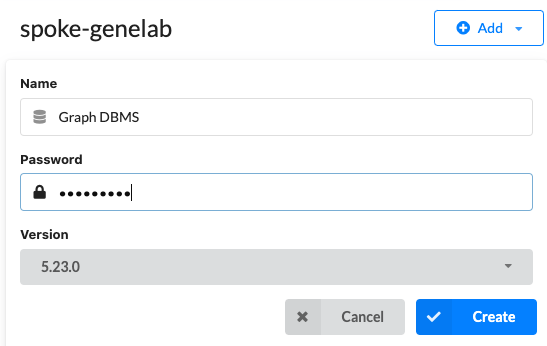
    
6. Select `Terminal` to open a terminal window.
    
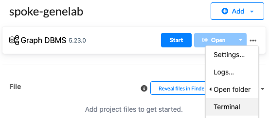

7. Type `pwd` in the terminal window to show the path to the `NEO4J_INSTALL_PATH` directory. This path is required in the `.env` file, see the next section.
 
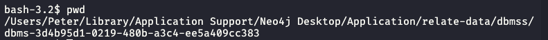


------

### Setup the Environment

Prerequisites: Miniconda3 (light-weight, preferred) or Anaconda3 and Mamba (faster than Conda)

* Install [Miniconda3](https://docs.conda.io/en/latest/miniconda.html)
* Update an existing miniconda3 installation: ```conda update conda```
* Install Mamba: ```conda install mamba -n base -c conda-forge```
* Install Git (if not installed): ```conda install git -n base -c anaconda```
------

1. Clone this Repository

```
git clone https://github.com/BaranziniLab/spoke_genelab.git
cd spoke_genelab
```

2. Create a Conda environment

The file `environment.yml` specifies the Python version and all required dependencies.

```
mamba env create -f environment.yml
```

3. Create an account in [BioPortal](https://bioportal.bioontology.org/) and copy the API key. BioPortal is used to map terms to ontologies.

   
4. Copy the file `env_template` to `.env`

5. Edit the file `.env` and set the following variables

KG version number

`KG_VERSION=v0.0.3`

Path to the cloned git repository

`KG_GIT=/Users/.../spoke_genelab/`

Path to the Neo4J instance in Neo4j Desktop (in quotes). Make sure to enclose the path in quotes.

`NEO4J_INSTALL_PATH="/Users/.../Library/Application Support/Neo4j Desktop/Application/relate-data/dbmss/dbms-3d4b95d1-0219-480b-a3c4-ee5a409cc383"`

BioPortal API Key

`BIOPORTAL_API_KEY=<bioportal api key>`

------

### Download and Process Datasets and upload to Neo4J Graph Database

1. Start the spoke-genelab Graph DBMS

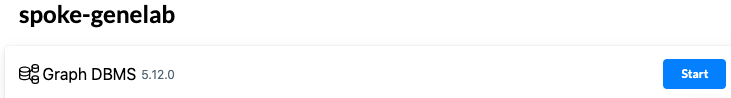

2. Activate the conda environment

```
conda activate spoke-genelab
```

3. Launch Jupyter Lab

```
jupyter lab
```

4. Navigate to the `notebooks` directory and run the following notebooks

| Notebook                   |   Description           |
|----------------------------|-------------------------|
| 1_download_datasets.ipynb  | Downloads datasets     |
| 2_create_study_mission_nodes.ipynb | Creates Study and Mission nodes and their relationships |
| 3_create_gene_nodes.ipynb  | Creates MGene (model organism) and mapped Gene (human) gene nodes |
| 4_create_assay_nodes.ipynb | Creates Assay nodes and their relationships |
| 5_import_to_neo4j.ipynb    | Imports the formatted data into a Neo4j KG |
| 6_query_examples.ipynb     | Runs example queries (optional) |

5. When the import is completed, click the `Refresh` button in Neo4j Desktop. The newly created database `spoke-genelab-v0.0.3` will be listed.

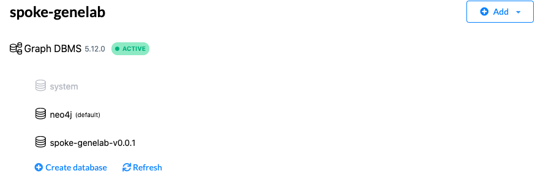

6. Click the `Open` button to launch the database.

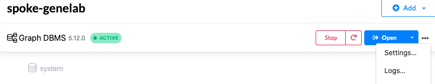

7. Click on the database icon on the left.


8. Use the pull-down menu to select a version of `spoke-genelab-v0.0.3` database. Wait for about 30+ seconds until the database is loaded and the nodes are listed as shown below.
   
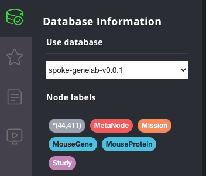

9. Set the Graph Stylesheet

Drag the file kg/v0.0.3/style.grass onto the Neo4j Browser window to set the node colors, sizes, and labels.

10. Now you are ready to run Cypher queries on the selected database.

11. When you are finished, stop the database in the Neo4j Desktop.

To stop the conda environment, type

```conda deactivate```

------

### Dump Neo4J Graph Database
1. Stop the database

2. Hover the cursor over the `spoke-genelab-v0.0.3` database and select `Dump` from the menu.

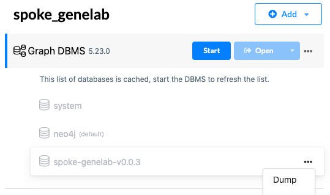

3. When the dump is complete, click the `Reveal files in Finder` button to open the directory that contains the `spoke-genelab-v0.0.3.dump` file.

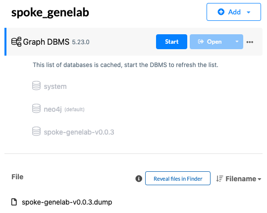

This database dump will be used to create the SPOKE-GeneLab composite database.

------

## 📚 Citation

PW Rose, CA Nelson, SG Gebre, K Soman, KA Grigorev, LM Sanders, SV Costes, SE Baranzini, NASA SPOKE-GeneLab Knowledge Graph. Available online: https://github.com/BaranziniLab/spoke_genelab (2025)

CA Nelson, PW Rose, K Soman, LM Sanders, SG Gebre, SV Costes, SE Baranzini, Nasa Genelab-Knowledge Graph Fabric Enables Deep Biomedical Analysis of Multi-Omics Datasets, https://ntrs.nasa.gov/citations/20250000723 (2025)

------

## 💰 Funding
NSF Award number [2333819](https://www.nsf.gov/awardsearch/showAward?AWD_ID=2333819), Proto-OKN Theme 1: Connecting Biomedical information on Earth and in Space via the SPOKE knowledge graph.

